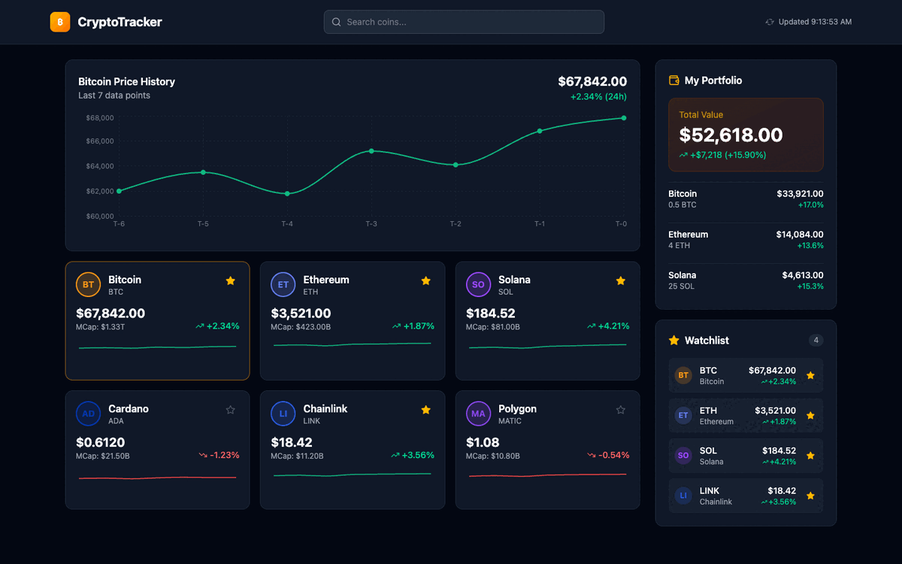

# React Crypto Tracker

A real-time cryptocurrency portfolio tracker built with React 19, TypeScript 5.7, and Tailwind CSS v4. Monitor live prices, track portfolio P&L, and manage your watchlist — all in one dark dashboard.

[](https://react.dev)
[](https://www.typescriptlang.org)
[](https://tailwindcss.com)
[](https://vitejs.dev)

## Preview



## Features

- **Live Price Simulation** — Prices update every 3 seconds
- **Portfolio Tracker** — Real-time P&L and percentage gains/losses
- **Price Charts** — Interactive Recharts line charts per coin
- **Watchlist** — Star/unstar coins to follow them
- **Search** — Filter coins by name or symbol
- **Responsive** — Mobile to desktop

## Tech Stack

| Technology | Version | Purpose |
|---|---|---|
| React | 19 | UI framework |
| TypeScript | 5.7 | Type safety |
| Tailwind CSS | v4 | Vite plugin — zero config |
| Recharts | 2.10 | Price charts |
| Lucide React | 0.344 | Icons |
| Vite | 6.2 | Build tool |

## Quick Start

```bash
git clone https://github.com/mariotavarez/react-crypto-tracker.git
cd react-crypto-tracker
npm install
npm run dev
```

## Structure — Atomic Design

```
src/
├── atoms/
│   ├── CoinSymbol.tsx      # Coin logo circle with dynamic color
│   ├── MarketCapText.tsx   # Formats T / B / M market cap
│   ├── PriceText.tsx       # Smart decimal formatting
│   ├── StarButton.tsx      # Amber watchlist toggle
│   └── TrendIndicator.tsx  # Change % with directional icon
├── molecules/
│   ├── CoinCard.tsx        # Full coin card with sparkline
│   ├── HoldingRow.tsx      # Portfolio holding row with P&L
│   ├── SearchBar.tsx       # Search + live refresh indicator
│   └── WatchlistItem.tsx   # Compact watchlist entry
├── organisms/
│   ├── AppHeader.tsx       # App header with SearchBar
│   ├── CoinGrid.tsx        # Grid of CoinCards
│   ├── PortfolioPanel.tsx  # Holdings with P&L summary
│   ├── PriceChart.tsx      # Selected coin price history
│   └── WatchlistPanel.tsx  # Starred coins list
├── templates/
│   └── TrackerLayout.tsx   # AppHeader + main content wrapper
├── pages/
│   └── TrackerPage.tsx     # Full page with state + hooks
├── data/cryptoData.ts
├── hooks/
│   ├── useCryptoData.ts    # Live price update loop
│   └── usePortfolio.ts     # Portfolio state
├── types/index.ts
├── App.tsx
└── main.tsx
```

## Tailwind CSS v4

```ts
// vite.config.ts
import tailwindcss from '@tailwindcss/vite'
export default defineConfig({ plugins: [react(), tailwindcss()] })
```

```css
/* src/index.css */
@import "tailwindcss";
```

## License

MIT © Mario Tavarez
